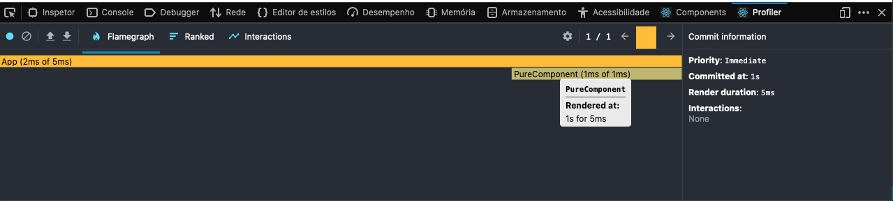
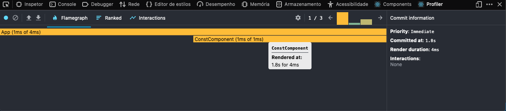

# React-Trace
Test and verify what more performance practices when use pure React with ES6 (vanilla js).

## Pure function x Class functions
Make same code a simple div with text with diferent scopes and test what is more fast.

This is screenshot of class component flamegraph

This is screenshot of pure component flamegraph

This is screenshot of pure component (CONST) flamegraph

